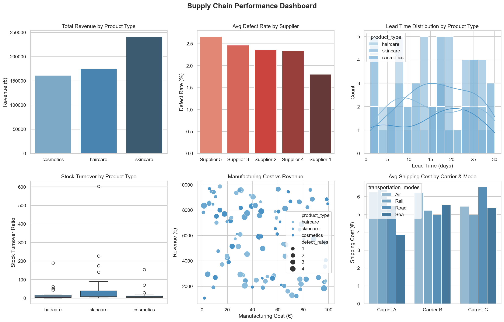

# Supply Chain Performance Analysis

End-to-end exploratory data analysis of a multi-category supply chain dataset,
covering product performance, supplier quality, logistics efficiency, and profitability KPIs.

Built with Python · SQLite · Pandas · Seaborn · Matplotlib

---

## Business Context

Supply chain costs can represent up to 18% of total operational costs in consumer goods companies.
This project simulates the analytical workflow of a Supply Chain BI Analyst:
identifying inefficiencies, ranking supplier performance, and surfacing actionable insights
from raw operational data.

---

## Dataset

- **Source:** [Kaggle — Supply Chain Analysis](https://www.kaggle.com/datasets/harshsingh2209/supply-chain-analysis)
- **Size:** 100 SKUs · 24 variables
- **Categories:** Skincare · Haircare · Cosmetics
- **Covers:** Pricing, stock levels, lead times, supplier data, shipping, manufacturing costs, defect rates

---

## Project Structure
```
supply_chain_analysis/
│
├── supply_chain_data.csv        # Raw dataset
├── supply_chain_clean.csv       # Cleaned dataset with derived KPIs
├── supply_chain.db              # SQLite database with analytical queries
│
├── analysis.py                  # Data cleaning, feature engineering & KPI summary
├── visualizations.py            # Dashboard with 6 charts
├── database.py                  # SQLite persistence & analytical SQL queries
│
└── supply_chain_dashboard.png   # Exported dashboard
```

---

## Key KPIs Engineered

| KPI | Formula |
|---|---|
| Gross Profit | Revenue − (Manufacturing + Shipping + Other Costs) |
| Profit Margin % | Gross Profit / Revenue × 100 |
| Stock Turnover | Units Sold / Stock Level |
| Cost per Unit | Total Costs / Units Sold |
| High Defect Risk | Defect Rate > Dataset Median |

---

## Key Findings

**Revenue & Profitability**
- Skincare leads in total revenue (€241,628) but carries the longest average lead times (16.7 days)
- Average profit margins exceed 85% across all product categories
- Top 5 SKUs by gross profit all achieve margins above 92%

**Supplier Quality**
- Supplier 1 is the highest performer: lowest defect rate (1.804%) and responsible for 2 of the top 5 most profitable SKUs
- Supplier 5 is the highest risk: highest defect rate (2.665%) and appears in 4 of the top 10 high-defect products, despite competitive manufacturing costs

**Logistics Efficiency**
- Sea freight is the most cost-efficient mode (avg €4.97) and fastest (avg 12.2 days), yet accounts for only 17 shipments vs 29 by Road
- Air freight is the most expensive (avg €6.02) and slowest (avg 18.3 days), an inefficiency worth investigating

---

## Dashboard



---

## How to Run
```bash
pip install pandas numpy matplotlib seaborn
python analysis.py
python visualizations.py
python database.py
```

---

## Skills Demonstrated

Python · Pandas · NumPy · Seaborn · Matplotlib · SQLite · SQL · EDA ·
Feature Engineering · KPI Design · Data Cleaning · Business Intelligence
